# PlayerPro Football Manager

PlayerPro is a full-stack football competition and team-management platform. It provides role-specific workspaces for managers, players, viewers, and competition organizers, together with a self-hosted AI assistant powered by Ollama.

The `Azure` branch includes a learning deployment on Azure Kubernetes Service (AKS), infrastructure managed with Terraform, a cloud-hosted Jenkins pipeline, Argo CD GitOps delivery, and Prometheus/Grafana monitoring.

Start with the [Linux and Azure setup guide](docs/LINUX-SETUP.txt) for the cloud lab, or follow the local development instructions below.

## Project structure

```text
FootBall-App/
├── frontend/      React + TypeScript + Tailwind CSS
├── backend/       Go + Gin + GORM + PostgreSQL
├── ai-service/    Python + FastAPI + Ollama
├── infra/         Terraform: AKS, ACR, Jenkins VM and networking
├── deploy/
│   ├── jenkins/   Jenkins Docker image
│   ├── helm/      Application Helm chart
│   ├── environments/  Git-managed image registry/tag and service settings
│   ├── argocd/    Argo CD Application
│   └── monitoring/   Prometheus/Grafana Helm values
├── docs/          Linux and Azure walkthrough
├── Jenkinsfile    Build, test, push and GitOps promotion pipeline
├── docker-compose.yml  Optional local container stack
└── README.md
```

## Main features

- Manager, player, viewer, and organizer accounts
- JWT authentication and role-based permissions
- Multiple competitions and seasons
- Competition-specific teams, budgets, fixtures, and standings
- Organizer competition, team, budget, fixture, and season management
- Manager squad management with up to 25 players
- Editable formations and starting lineups
- Player profiles, availability, and performance statistics
- Team performance and recent-match results
- Live, scheduled, and completed match views
- Transfer requests and contract negotiation
- Transfer and salary budget management
- Contract offers, counteroffers, approval, rejection, and expiry
- Notifications and mutation audit logs
- Responsive PlayerPro AI chatbox
- Role-aware football assistance using a local Ollama model

## Architecture

```text
Browser
   │
   ▼
React frontend :3000
   │ JWT-authenticated requests
   ▼
Go backend :8080 ───────► PostgreSQL :5432
   │ trusted internal request
   ▼
Python AI service :8000
   │ local inference request
   ▼
Ollama :11434
```

The frontend never receives the database credentials, JWT secret, or AI service token. The Go backend verifies the signed-in user and builds trusted football context before contacting the Python service.

## Azure deployment

```mermaid
flowchart TD
    Dev[Developer: push to Azure branch] --> Git[GitHub]
    Git --> Jenkins[Jenkins VM: Central India, Zone 1]
    Jenkins --> Build[Tests and Docker image builds]
    Build --> ACR[Azure Container Registry: South India]
    Jenkins --> Tags[Commit image tag to Azure branch]
    Tags --> Argo[Argo CD on AKS]
    Argo --> AKS[AKS: South India]
    ACR --> AKS
    Browser[Browser] --> Frontend[React / NGINX]
    Frontend --> Backend[Go API]
    Backend --> DB[PostgreSQL]
    Backend --> AI[FastAPI]
    AI --> Ollama[Ollama: llama3.2:1b]
    AKS --> Frontend
    AKS --> Prometheus[Prometheus: cluster and pod metrics]
    Prometheus --> Grafana[Grafana dashboards]
```



| Component | Lab configuration |
| --- | --- |
| Jenkins | Ubuntu VM, Central India Zone 1, `Standard_D4s_v5` |
| AKS | South India, Free management tier, one `Standard_D4s_v5` node |
| Container registry | ACR Basic in South India |
| Application | Five Deployments and five Services managed by Helm/Argo CD |
| Persistent data | PVCs for PostgreSQL (8 GiB), uploads (4 GiB), and Ollama (16 GiB) |
| Monitoring | Prometheus and Grafana installed separately with Helm |

Each VM has 4 vCPUs and 16 GiB RAM. The lab uses separate regions because the checked subscription has a 4-vCPU regional limit. Availability and quota must be checked for your own subscription. Jenkins downloads and builds images on its Azure VM; local Docker testing is optional.

### CI/CD workflow

1. Push an application change to the **`Azure`** branch.
2. Jenkins polls GitHub approximately every five minutes.
3. Docker builds run Go tests, frontend TypeScript checking and a production build, and Python syntax compilation.
4. Jenkins pushes frontend, backend and AI-service images to ACR, tagged with the source commit SHA.
5. Jenkins updates [lab.yaml](deploy/environments/lab.yaml) and commits with `[skip ci]` to avoid a build loop.
6. Argo CD follows the same branch and synchronizes the Helm chart to AKS.

Jenkins uses credential IDs `acr-push` and `github-push`. The GitHub credential needs repository Contents read/write permission for promotion commits. A protected branch may require a different promotion workflow. Python compilation is a syntax check, not a unit-test suite; frontend unit tests are not part of this pipeline.

### Deployment prerequisites

Follow the [setup guide](docs/LINUX-SETUP.txt) in order: provision infrastructure, configure cloud Jenkins, publish images, create Kubernetes secrets/schema, install Argo CD, and install monitoring.

- The `playerpro-secrets` Kubernetes Secret supplies database credentials, `JWT_SECRET`, and `AI_SERVICE_TOKEN`.
- The `postgres-schema` ConfigMap contains the existing SQL file `backend/migrations`. PostgreSQL initializes it only on an empty database volume.
- Pull `llama3.2:1b` inside the AKS Ollama pod after deployment. A running Ollama container alone does not mean the model is available.
- Replace repository/account-specific settings before reusing this setup. Do not commit local environment files, Terraform variable/state/plan files, or SSH private keys. Keep `.terraform.lock.hcl` in Git.

### Access the application and tools

Run these commands on the **local computer** with the AKS context selected. Keep each port-forward command running in a separate terminal.

| Service | Local access command | Browser URL |
| --- | --- | --- |
| Application | `kubectl -n playerpro port-forward svc/frontend 8081:80` | `http://localhost:8081` |
| Argo CD | `kubectl -n argocd port-forward svc/argocd-server 8082:443` | `https://localhost:8082` |
| Grafana | `kubectl -n monitoring port-forward svc/monitoring-grafana 3001:80` | `http://localhost:3001` |

Jenkins uses an SSH tunnel from the project root on the local computer:

```bash
jenkins_ip=$(terraform -chdir=infra output -raw jenkins_ip)
ssh -i "$HOME/.ssh/playerpro_lab" -N -o ExitOnForwardFailure=yes \
  -L 127.0.0.1:8090:127.0.0.1:8090 "azureuser@$jenkins_ip"
```

Then open `http://localhost:8090`. If your public IPv4 changes, update `admin_ssh_cidr` in local Terraform variables and review/apply the network rule change before reconnecting.

The frontend is configured as a `LoadBalancer` for a **temporary public HTTP demo**. Find its address with:

```bash
kubectl -n playerpro get svc frontend
```

Open `http://<EXTERNAL-IP>` using the returned address; no frontend port-forward is needed for this route. Use dummy accounts/data until domain and HTTPS support are configured. The backend, PostgreSQL, FastAPI and Ollama Services remain `ClusterIP`. To remove public exposure, change `frontendServiceType` back to `ClusterIP` in `deploy/environments/lab.yaml` and commit/push with `[skip ci]` so Argo CD reconciles it.

### Verification and monitoring

```bash
kubectl -n playerpro get pods,svc,pvc
kubectl -n argocd get applications
kubectl -n playerpro exec deployment/ollama -- ollama list
```

The lab walkthrough has been exercised through application/AI testing, a code change promoted by Jenkins and Argo CD, monitoring, and a stop/start persistence check. Check live status rather than treating this README as a service-availability guarantee.

In Grafana, open **Kubernetes / Compute Resources / Namespace (Pods)** and select `playerpro`. These dashboards show infrastructure CPU/memory metrics; application request latency and AI-token metrics need additional instrumentation. Prometheus retention is configured to six hours and Grafana persistence is disabled, so monitoring history/custom dashboards are not durable backups.

### Lab limits and shutdown

This is an educational single-node setup. Deployment updates use `Recreate` and can cause downtime. Automatic AKS upgrades are disabled for the short lab; a system-node upgrade using the configured surge node needs additional regional/family CPU quota. Plan upgrades and availability before long-term use.

The $80 lab budget is a planning target, not an automatic spending cap. AKS Free tier does not make worker VMs, disks or networking free. Review actual usage, including transfers between regions.

From the **local project terminal**, after active Jenkins builds finish:

```bash
rg=$(terraform -chdir=infra output -raw resource_group)
aks=$(terraform -chdir=infra output -raw aks_name)
jenkins_vm=$(terraform -chdir=infra output -raw jenkins_vm_name)
az vm deallocate --resource-group "$rg" --name "$jenkins_vm"
az aks stop --resource-group "$rg" --name "$aks"
```

To resume:

```bash
az vm start --resource-group "$rg" --name "$jenkins_vm"
az aks start --resource-group "$rg" --name "$aks"
```

In a new terminal, first rerun the three variable assignments. Stopping compute retains data but disks, registry and other resources can still incur charges. For permanent cleanup, back up required database/uploads/Jenkins data and follow Part 23 of the setup guide to review a Terraform destroy plan. Keep your local Terraform state secure until cleanup is complete.

## Local development

The following instructions run the services directly on a developer machine, independently of the Azure deployment. Commands use Bash on Linux unless labeled otherwise. Run each service from its own terminal, starting at the repository root.

## Prerequisites

Install the following software:

- Node.js and npm
- Go 1.24 or a compatible version
- Python 3.10 or newer
- PostgreSQL
- Ollama

## 1. Database setup

Create a PostgreSQL database:

```sql
CREATE DATABASE "football-app";
```

The backend runs GORM migrations and development seed operations during startup.

## 2. Backend setup

Create `backend/.env` using `backend/.env.example` as a guide:

```env
APP_NAME=PlayerPro
APP_ENV=development
APP_PORT=8080
APP_URL=http://localhost:8080

DB_DRIVER=postgres
DB_HOST=localhost
DB_PORT=5432
DB_USER=postgres
DB_PASSWORD=your-postgres-password
DB_NAME=football-app

JWT_SECRET=replace-with-a-long-random-secret
JWT_EXPIRATION=24h
CORS_ALLOWED_ORIGINS=http://localhost:3000
UPLOAD_PATH=./uploads

AI_SERVICE_URL=http://localhost:8000
AI_SERVICE_TOKEN=replace-with-the-shared-ai-service-token
```

Generate a random token on Linux:

```bash
openssl rand -hex 32
```

Use a separate generated value for `JWT_SECRET`. The `AI_SERVICE_TOKEN` value must match the value in `ai-service/.env`.

Install dependencies and start the backend:

```bash
cd backend
go mod download
go run ./cmd/server
```

The API will be available at `http://localhost:8080/api`.

## 3. Ollama setup

Download and install Ollama from [ollama.com](https://ollama.com/), then pull a model:

```bash
ollama pull llama3.2:1b
ollama list
ollama run llama3.2:1b
```

Use `/bye` to exit the interactive Ollama prompt. Ollama normally continues running in the background.

For a more capable model on a computer with sufficient memory, use `llama3.2:3b` instead.

## 4. AI service setup

Create `ai-service/.env`:

```env
AI_SERVICE_TOKEN=replace-with-the-shared-ai-service-token
OLLAMA_URL=http://localhost:11434
OLLAMA_MODEL=llama3.2:1b
OLLAMA_TIMEOUT_SECONDS=120
OLLAMA_MAX_OUTPUT_TOKENS=500
```

The model name must match a model shown by `ollama list`.

Create the virtual environment, install packages, and start FastAPI:

```bash
cd ai-service
python3 -m venv venv
source venv/bin/activate
pip install -r requirements.txt
uvicorn app.main:app --reload --port 8000
```

Verify the service:

```text
http://localhost:8000/health
```

The expected provider status is `ok`. Interactive API documentation is available at `http://localhost:8000/docs`.

## 5. Frontend setup

The `frontend/.env` file should contain:

```env
REACT_APP_API_URL=http://localhost:8080/api
```

Install packages and start React:

```bash
cd frontend
npm install
npm start
```

Open `http://localhost:3000`.

## Recommended run order

Run each service in a separate terminal:

1. PostgreSQL
2. Ollama
3. Python AI service on port `8000`
4. Go backend on port `8080`
5. React frontend on port `3000`

## AI assistant flow

The floating AI button appears at the bottom-right of authenticated pages.

```text
React sends message + selected season ID
    ↓
Go validates JWT and loads authorized database context
    ↓
Go sends role, team, competition, match, and budget context
    ↓
FastAPI constructs the assistant prompt
    ↓
Ollama generates the response on the host or AKS node
```

The assistant is read-only. It can explain data and offer advice, but it cannot execute transfers, contracts, deletions, or budget changes.

## Tests and verification

Backend tests:

```bash
cd backend
go test ./...
```

Frontend TypeScript check:

```bash
cd frontend
npx tsc --noEmit
```

Frontend production build:

```bash
cd frontend
npm run build
```

Python syntax check:

```bash
cd ai-service
venv/bin/python -m compileall -q app
```

## Common issues

### AI service is unavailable

Confirm that Ollama and FastAPI are running:

```bash
ollama list
curl -fsS http://localhost:8000/health
```

### AI service returns `401 Invalid service token`

Make sure `AI_SERVICE_TOKEN` is identical in:

- `backend/.env`
- `ai-service/.env`

Restart both services after changing environment files.

### Ollama reports `model_missing`

Pull the configured model and ensure its name matches `OLLAMA_MODEL`:

```bash
ollama pull llama3.2:1b
ollama list
```

### Backend returns a database connection error

Confirm PostgreSQL is running and verify `DB_HOST`, `DB_PORT`, `DB_USER`, `DB_PASSWORD`, and `DB_NAME` in `backend/.env`.

### Port already in use

Stop the previous process using the port before starting another instance of the same service.

## Security notes

- Never commit real `.env` files or credentials.
- Never place `AI_SERVICE_TOKEN`, `JWT_SECRET`, or database credentials in React.
- Use a long random `JWT_SECRET` in production.
- Keep Ollama and the Python AI service private in production deployments.
- Configure explicit CORS origins instead of allowing every origin.
- The backend rejects unsupported JWT signing algorithms.

## License

This project is intended for educational and portfolio use. Add a license file before distributing or using it commercially.
